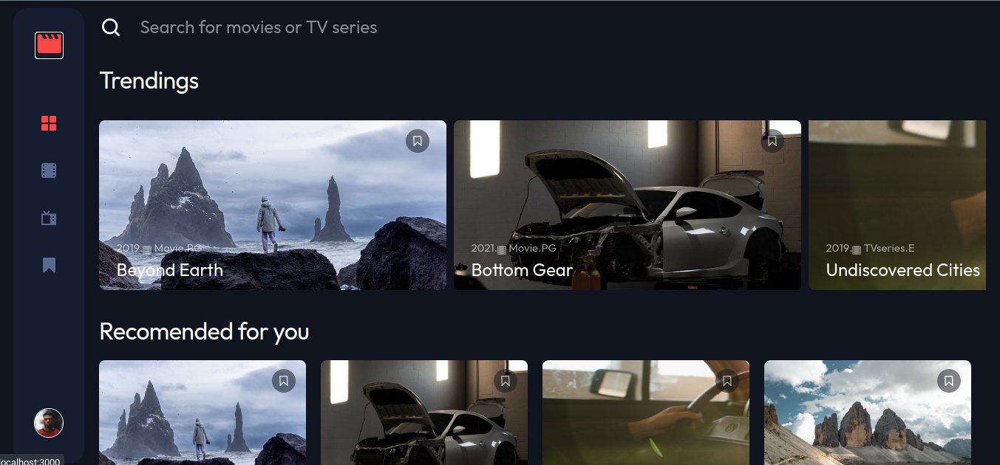

## Overview

### The challenge

Users should be able to:

- View the optimal layout for the app depending on their device's screen size
- See hover states for all interactive elements on the page
- Navigate between Home, Movies, TV Series, and Bookmarked Shows pages
- Add/Remove bookmarks from all movies and TV series
- Search for relevant shows on all pages

### Screenshot

### Links

- Solution URL: [Add solution URL here](https://github.com/levaniakobidze/React-Todo-app)
- Live Site URL: [Add live site URL here](https://entertainment-web-app-levan.vercel.app/)

## My process

### Built with

- Semantic HTML5 markup
- CSS custom properties
- Flexbox
- CSS Grid
- [React](https://reactjs.org/) - JS library
- [Css-modules] - For styles

### What I learned

- i learned how to use context-api to menage the state.

## Author

- Website - [Portfolio](https://levaniakobidze.vercel.app/)
- Github - [@LevanIakobidze](https://github.com/levaniakobidze)
- Linkedin - [@yourusername](https://www.linkedin.com/in/levan-iakobidze-b0b60923b/)
